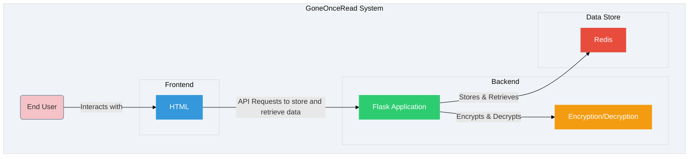

# GoneOnceRead
A simple self-hosted service to securely share sensitive information via one-time links, using encryption and automatic self-destruction after viewing.
Once the information is viewed, the link becomes invalid, ensuring that sensitive data is never stored longer than necessary. The service employs encryption to protect data at rest and is designed for ease of use and deployment with Docker.

## Features

- 🔒 **Secure Sharing:** Uses encryption to protect sensitive information.
- 📜 **One-Time Links:** Generates shareable links that are invalidated after a single view.
- 🕒 **Auto-Destruct:** Data is automatically deleted after it's viewed or after a configurable expiration time.
- 📦 **Docker Support:** Easily deployable with Docker and Docker Compose.
- 🧰 **Self-Hosted:** Take full control by running the service on your own infrastructure.

## How It Works

1. A user submits sensitive information via a web form and sets it to expire after a certain time if not viewed. For an extra layer of protection, a password can be used to protect the secret. 
2. The backend encrypts the information and generates a unique, shareable link.
3. The recipient accesses the link and views the sensitive information. If a password was used in the secret creation, the recipient uses it to access the secret. 
4. After viewing, the link is invalidated and the encrypted data is deleted.

## If you like charts



## Getting Started

### Prerequisites

- **Recommended** Docker and docker-compose for easy setup.

### Installation

1. Clone the repository:

   ```bash
   git clone https://github.com/alexjyong/GoneOnceRead.git
   cd GoneOnceRead
   ```
2. Build and run the app with Docker Compose:
   ```bash
   docker-compose build
   docker-compose up
   ```
3. Open your browser and navigate to http://localhost:8080 (or if you are running this on Github codespaces, the url given to you in ports section) to access the service.
